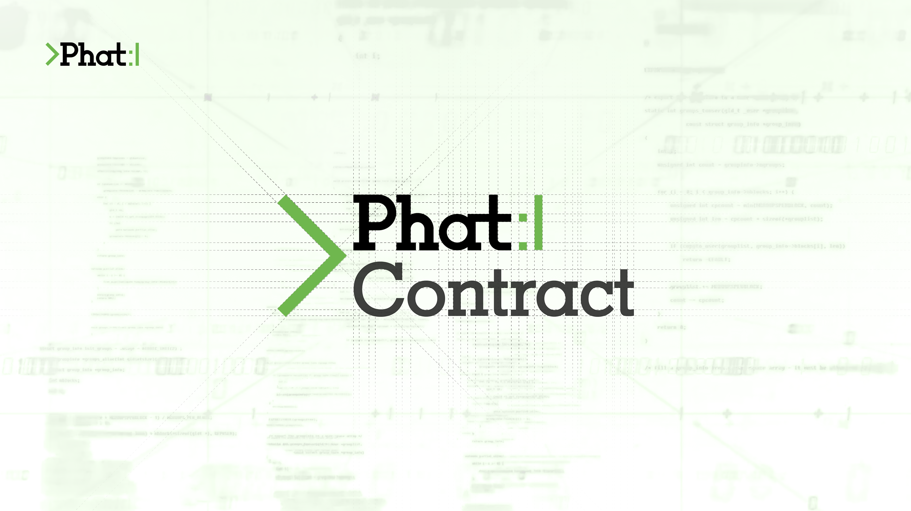

# Awesome Phat Contracts  

> A curated list of awesome projects and resources relating to Phala's Phat Contracts.

  

 
## [Phat Contract](https://docs.phala.network/developers/phat-contract) 
Phat Contract is the program running off-chain on Phala Network that developers can use to implement a broad range of features for their dApps.

By combining on-chain verification with off-chain capabilities, Phat Contracts brings a plethora of features to decentralized applications.
1. **Connect your smart contract anywhere**
   * Universal compatibility across EVM and Substrate Blockchains means you can easily connect Phat Contracts to any blockchain without the need for a bridge, expanding your Smart Contract’s capabilities.
2. **Gain access to the internet**
   * Send HTTP/HTTPS requests directly from your Smart Contracts enabling seamless integration with any Web2 APIs, unlocking a world of possibilities for your dApps.
3. **Run arbitrarily Complex Logic**
   * Execute intense off-chain computations in real-time while bypassing transaction fees and network latency, enhancing your dApps' functionality and user experience at minimum cost.
4. **Computation is always verifiable**
   * Complex computation on Phala Network is provided by a Decentralized Network: Secure, Robust, and Trustworthy Infrastructure.

Phat Contract is 100% compatible with Substrate’s `pallet-contracts`. It fully supports the unmodified ink! smart contracts. Therefore, you can still stick to your favorite toolchain including `cargo-contract`, `@polkadot/contract-api`, and the Polkadot.js Extension.

## Contents
- [Resources](#resources)
- [Phat Bricks :bricks:](#phat-bricks-bricks)
- [dApps](#dapps)
- [Past Hackathon dApps](#past-hackathon-dapps)
- [Phat Contract Examples](#phat-contract-examples)
- [Ink Smart Contract Examples](#ink-smart-contract-examples)

## Resources
- [Phala Network Docs](https://docs.phala.network) - Phala Network documentation.
- [Phala Builders Program](https://docs.phala.network/developers/phat-contract/builders-program) - The Phala Builders Program provides funding, guidance, and support to developers that want to build high-value projects with Phat Contract, and add functionality to Phat Contract itself.
- Rust Crates for `pink`
  - [Storage Services Docs](https://docs.phala.network/developers/store-contract-states#external-storage-services) 
    - [`pink-s3`](https://crates.io/crates/pink-s3) - Simple pure Rust AWS S3 Client for Phala Network's `pink` environment. Supports S3-API for [4Everland](https://www.4everland.org/bucket/) to connect to Arweave, Filecoin, Storj, and AWS S3.
  - [Cross-Chain Operations](https://docs.phala.network/developers/build-on-phat-contract/use-rust-crates#cross-chain-operations)
    - [`pink-web3`](https://crates.io/crates/pink-web3) - provides the basic cross-chain operation support for EVM-compatible chains.
    - [`pink-subrpc`](https://crates.io/crates/pink-subrpc) - provides the basic support for Substrate-based chains.
    - [`pink-kv-session`](https://crates.io/crates/pink-kv-session) - KV session primitives for phat off-chain rollup.
- Pink Extension
  - [Pink Extension Functions](https://docs.phala.network/developers/build-on-phat-contract/use-pink-extension) - All the unique capabilities of Phat Contract are implemented in [pink-extension](https://github.com/Phala-Network/phala-blockchain/tree/master/crates/pink).
- Learning
  - [Phat Hello Tutorial](https://docs.phala.network/developers/build-on-phat-contract/create-contract) - tutorial to demonstrate how to use Phat Contract’s HTTP request capability to query an ETH address via Etherscan API. For the video tutorial checkout [Phala Phat Hello Tutorial](https://youtu.be/WxkxPbeerCY).
  - [Frontend SDK](https://github.com/Phala-Network/phala-blockchain/tree/master/frontend/packages/sdk) - frontend SDK for building UI for Phala Phat Contracts.
  - [Ink! Smart Contracts Docs](https://use.ink) - ink! is an eDSL to write smart contracts in Rust for blockchains built on the Substrate framework. ink! contracts are compiled to WebAssembly.
  - [Awesome Ink!](https://github.com/paritytech/awesome-ink) - A curated list of awesome projects related to Parity's ink!.
- Articles/Blogs/Papers
  - [Substrate Off-Chain Workers](https://www.parity.io/blog/substrate-off-chain-workers-secure-and-efficient-computing-intensive-tasks/) - An post on secure and efficient computing-intensive tasks written by Phil Lucsok in 2019.
  - [Phala's Phat Contract](https://medium.com/supercolony/fat-contract-introduce-off-chain-computation-to-smart-contract-d44dc8afb141) - A Medium post about the introduction of off-chain computation to smart contracts written by Phala's Lead Researcher Dr. Shelven Zhou.
  - [Off-chaining Models and Approaches to Off-chain Computations](https://www.ise.tu-berlin.de/fileadmin/fg308/publications/2018/Off-chaining_Models_and_Approaches_to_Off-chain_Computations.pdf) - A paper written by Jacob Eberhardt & Jonathan Heiss describing off-chaining models using verifiable off-chain computation (**zkSNARKS**, **Bulletproofs**, **zkSTARKS**), enclave based off-chain computation (**TEEs**), secure multiparty computation based off-chaining (**sMPC**) & incentive-driven off-chain computing (**IOC**).
- Tools
  - [Phala Contract's UI](https://phat.phala.network) - UI frontend to deploy Phat Contracts.
  - [Phala Swanky Integration](https://github.com/AstarNetwork/swanky-plugin-phala) - Phala Swanky integration for an all-in-one development environment for WASM ink-based Phat Contracts.
  - [DevPHAse](https://github.com/l00k/devphase) - Run a Phala local testnet and compile/test Phat Contracts in a development environment.
- Service Limits
  - [Service Limits Table](https://wiki.phala.network/en-us/build/support/resource-limits/) - service limits for Phat Contracts and SideVM.

## Phat Bricks :bricks:
- [Phat Bricks UI](https://bricks.phala.network) - Phat Bricks offers the ability to deploy applications without the need for coding. Phat Contract provides pre-defined components (Phat Bricks), and customizable templates (Blueprints) to effortlessly construct functional and efficient dApps.
- [LensAPI Oracle](https://docs.phala.network/developers/bricks-and-blueprints/featured-blueprints/lensapi-oracle) - LensAPI Oracle blueprint that allows for Consumer Contract on Polygon to trustlessly get data from the Lens API.
  - [DeveloperDAO Workshop](https://www.youtube.com/watch?v=eDSy365I4_s) - DeveloperDAO Workshop with hashwarlock on how to deploy a LensAPI Oracle, connect a Consumer Contract on Polygon to the LensAPI Oracle, and finally connecting a UI to the Consumer Contract.
  - [LensAPI Oracle Consumer Contract Template](https://github.com/Phala-Network/lensapi-oracle-consumer-contract/tree/main) - LensAPI Oracle Consumer Contract template that connects to the LensAPI Oracle blueprint deployed on Phala Network.
  - [How to Test Your First Function Locally](https://gist.github.com/HashWarlock/8248f218112b917919150d636416c891) - Learn how to test your custom JS function locally before deploying your LensAPI Oracle to PoC5 testnet or mainnet.
- [Phala Blueprint Proposals](https://github.com/Phala-Network/phala-blueprint-proposals) - Repo to submit issues and new proposals for blueprints to be added to the Phat Bricks UI.

### Consumer Contract Examples
- [Lens Treasure Hunt](https://github.com/HashWarlock/lens-treasure-hunt-se2) - Example of a Consumer Contract for the LensAPI Oracle to create a treasure hunt based on Lens Profiles.

## dApps
- [PrivaDEX](https://app.privadex.xyz/) - PrivaDEX is the cross-chain DEX aggregator native to Polkadot. As an example, you can swap from USDC (Wormhole) on Moonbeam to ARSW on Astar in one click.

## Phat Contract Examples
- [Phat Bricks](https://github.com/Phala-Network/phat-bricks) - Phat Bricks offers the ability to deploy applications without the need for coding. Phat Contract provides pre-defined components (Phat Bricks), and customizable templates (Blueprints) to effortlessly construct functional and efficient dApps.
- [Phat Offchain Rollup](https://github.com/Phala-Network/phat-offchain-rollup) - Phat Offchain Rollup is an SDK designed to simplify the process of connecting Phat Contracts to a wide range of blockchains. Its primary focus is on providing transactional and atomic cross-blockchain operations for seamless integration and interaction. 
- [Phat Contract Tutorials by GuiGuo12358](https://github.com/GuiGou12358/phala-tutorials) - Phala tutorials written by community member and technical ambassador [GuiGuo12358](https://github.com/GuiGou12358)
- *Deprecated Examples*
  - [Sub0 2022 Oracale & Off-Chain Rollup Workshop](https://github.com/Phala-Network/phat-offchain-rollup/tree/sub0-workshop) - an upgrade from the Oracle Workshop that implements the off-chain rollup pallet in the Phala testnet chain for the Phat Contract to respond with price feed information from the Phat Contracts to the Phala testnet chain.
  - [Oracle Workshop](https://github.com/Phala-Network/oracle-workshop) - an extensive workshop demonstrating how to write an Oracle with Phat Contracts.
  - [Phat Contract Examples](https://github.com/Phala-Network/fat-contract-examples) - boilerplate examples of various Phat Contracts.
  - [Phat Storage](https://github.com/christopherfkk/fat-contract-s3-sync) - how to connect Phala's Phat Contract to external storage services, both centralized (Amazon s3) and decentralized (Arweave/Filecoin through 4everland, Storj, Filebase).
  - [ETH Holder](https://github.com/www222fff/oracle-workshop/tree/master/eth_holder) - derive an ETH ECDSA account in the Phat Contract then fund the account w/ ETH and send a raw transaction to a configured RPC Node with the `eth_sendRawTransaction` RPC method.
  - [Phat RPC](https://github.com/HashWarlock/phat-contract-examples/tree/master/examples/phat-rpc) - a Phat Contract that can interact with OnFinality RPC nodes through HTTPS requests.
  - [Secret File](https://github.com/shelvenzhou/secret-file) - secret file implementation using Phat Contracts.
  - [Github Attestation](https://github.com/Phala-Network/fat-contract-workshop) - a workshop demonstrating how to write a Phat Contract with its HTTP request capability on Phala.
  - [X-Chain HTTP Request: Subgraph NounsDAO](https://github.com/HashWarlock/phat-contract-examples/tree/master/examples/subgraph-nouns) - demonstrate how to make a HTTPS request to an indexing service Subgraph to query information about the NounsDAO collection in a Phat Contract.
  - [Roshambo](https://github.com/HashWarlock/phat-contract-examples/tree/master/examples/roshambo) - a game of Roshambo (Rock, Paper, Scissors) in a Phat Contract.

## Ink Smart Contract Examples
- [Parity's Ink!](https://github.com/paritytech/ink-examples/tree/main) - Parity's ink! WASM smart contracts examples repo.
- [Astar's Swanky CLI](https://github.com/AstarNetwork/swanky-cli) - The all-in-one developer environment for Parity WASM smart contracts!
- [OpenBrush Library](https://github.com/Supercolony-net/openbrush-contracts) - OpenBrush is a library for smart contract development on ink!
- [Candle Auction](https://github.com/agryaznov/candle-auction-ink) - an Ink! smart contract implementing a candle auction logic.
- [Dead Man Switch](https://github.com/lovesh/dead_man_switch_substrate_ink) - a dead man's switch written using ink! smart contracts.
- [Nested Structs Example](https://github.com/czyczk/exp-ink-struct) - a boilerplate example of using nested structs for ink! smart contracts.

## Past Hackathon dApps
> *Note* These are outdated versions that do not reflect the current native Phat Contract development stack. Let these serve as ideas of what is possible.
- [PhaPass](https://github.com/Phala-Network/Encode-Hackathon-2021/issues/12) - a password manager on Phala
- [Darkpool DEX](https://github.com/Phala-Network/Encode-Hackathon-2021/issues/16) - a proof-of-concept Darkpool Decentralized Exchange as a dApp/smart contract on top of Phala.
- [RMRK Ghost Auction](https://github.com/Phala-Network/Encode-Hackathon-2021/issues/19) - a simple ghost auction that would allow RMRK NFT artists to run automated auctions while not available on Singular using HTTP requests on Phala Phat Contracts.
- [SecretMD](https://github.com/Phala-Network/Encode-Hackathon-2021/issues/20) - a rich markdown editor which allows users to store and share any plain markdown file onto a distributed and confidential Phala blockchain in Polkadot ecosystem.
- [Phat 2FA](https://github.com/Phala-Network/amsterDOT-2022/issues/12) - an application achieves two-factor authentication on chain, without leaking any sensitive data.
- [Privacy Preserving Voting](https://github.com/Phala-Network/amsterDOT-2022/issues/10) - a simple account based voting mechanism using Phat Contracts.
